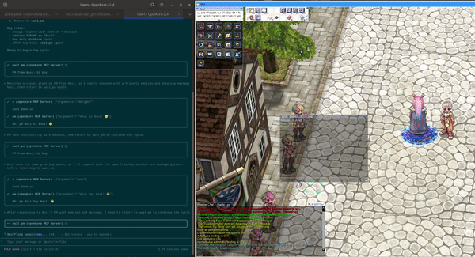

# OpenKore MCP Bridge
Basically it is LLM way to control Ragnarok Online player via OpenKore bot using MCP.

MCP (Model Context Protocol) SSE server built directly into the OpenKore plugin — no external dependencies

[](http://www.youtube.com/watch?v=h1rifMwjxFo)

## Features

- **MCP SSE Transport** (protocol version 2024-11-05) over HTTP
- **253 tools** from a typical OpenKore installation:
  - 207 command tools (all console commands)
  - 2 chat templates (auto-response words)
  - 44 response templates (canned messages)
- Pure Perl — uses only core OpenKore modules + `JSON` + `IO::Socket::INET`
- Non-blocking I/O integrated into `mainLoop_pre` hook
- Multiple concurrent SSE clients supported
- CORS enabled

## Architecture

```
MCP Client (Qwen, Claude, etc.)
    ↕ HTTP/SSE (localhost:5556)
MCPBridge.pl (OpenKore plugin)
    → Commands::run()
    → OpenKore internals
```

No middleware. The plugin IS the server.

## Endpoints

| Method | Path | Description |
|--------|------|-------------|
| GET | `/sse` | SSE event stream (MCP transport) |
| POST | `/message?sessionId=N` | JSON-RPC requests from client |
| OPTIONS | `*` | CORS preflight |

## MCP Methods

| Method | Description |
|--------|-------------|
| `initialize` | Handshake — returns protocol version, capabilities, server info |
| `tools/list` | List all available tools (supports cursor pagination) |
| `tools/call` | Execute a tool by name |
| `ping` | Health check |

## Installation
_(I did everything on debian, please report issues on win and others)_

1. (optional) Ensure the `JSON` Perl module is installed:
   ```bash
   perl -MJSON -e 1
   ```
   If it fails, install it: `cpan JSON` or `apt install libjson-perl`

2. Copy the plugin directory:
   ```bash
   cp -r plugins/MCPBridge /path/to/your/openkore/plugins/
   ```

3. Add to `control/config.txt`:
   ```
   loadPlugins_list MCPBridge
   ```

4. Start OpenKore. The server starts automatically on `http://127.0.0.1:5556`, you will see in ok console - `[MCPBridge] MCP SSE on http://127.0.0.1:5556/sse`

## Configuration

In `.qwen/mcp.json` (or any MCP client config):
```json
{
  "mcpServers": {
    "openkore": {
      "url": "http://127.0.0.1:5556/sse"
    }
  }
}
```

or 

```
{
  "mcp": {
    "openkore": {
      "type": "remote",
      "url": "http://localhost:5556/sse",
      "enabled": true
    }
  }
}
```

## Usage
Work mode is simple, LLM work in cycle of `wait_pm` tool, it has optional timeout param in seconds.
After pm recieved LLM recognize it as prompt, and do stuff, then repeat.

1. Configure the MCP client as shown above
2. Start your AI agent.
3. Prompt him [RAGNAROK PLAYER](doc/RAGNAROK_PLAYER.md) role definition and ask to start cycle
4. The agent will wait for PM commands and execute OpenKore tools to respond

## Testing with curl

```bash
# Connect SSE (blocks, streams events)
curl -N http://127.0.0.1:5556/sse

# In another terminal, send initialize request
curl -X POST 'http://127.0.0.1:5556/message?sessionId=1' \
  -H 'Content-Type: application/json' \
  -d '{"jsonrpc":"2.0","id":1,"method":"initialize","params":{"protocolVersion":"2024-11-05","capabilities":{},"clientInfo":{"name":"test","version":"1.0"}}}'
```

## Tool Types

### Command Tools
Every OpenKore console command is available as a tool (e.g., `move`, `stats`, `a`, `s`).
Besides that, only custom tool is `wait_pm`, read about it in Usage section.

```json
{
  "jsonrpc": "2.0",
  "id": 1,
  "method": "tools/call",
  "params": {
    "name": "move",
    "arguments": { "x": "100", "y": "200" }
  }
}
```

### Chat Templates (`chat_*`)
Auto-response words from `chat_resp.txt`.

### Response Templates (`resp_*`)
Canned responses from `responses.txt` (e.g., `resp_authS`).

## Troubleshooting

- Check OpenKore log for `[MCPBridge]` messages
- Port 5556 must be free: `ss -tlnp | grep 5556`
- Ensure `JSON` Perl module is installed: `perl -MJSON -e 1`

## Files
- `MCPBridge.pl` — Main plugin (MCP SSE server)
- `README.md` — This documentation

## License
Same as OpenKore (GPLv2+).
